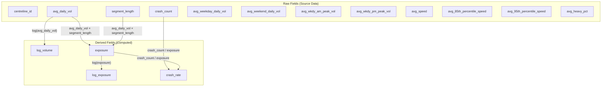

# Feature Dependencies — Logic Flowchart

## Column Inventory

| Column | Type | Notes |
|---|---|---|
| `centreline_id` | Raw | Segment identifier |
| `segment_length` | Raw | Metres |
| `crash_count` | Raw | Observed crashes |
| `avg_daily_vol` | Raw | All-day average |
| `avg_weekday_daily_vol` | Raw | Weekday subset |
| `avg_weekend_daily_vol` | Raw | Often missing |
| `avg_wkdy_am_peak_vol` | Raw | AM peak hour |
| `avg_wkdy_pm_peak_vol` | Raw | PM peak hour |
| `avg_speed` | Raw | Mean speed (km/h) |
| `avg_85th_percentile_speed` | Raw | Often missing |
| `avg_95th_percentile_speed` | Raw | Often missing |
| `avg_heavy_pct` | Raw | Heavy vehicle %; frequently missing |
| `log_volume` | Derived | log(avg_daily_vol) |
| `exposure` | Derived | avg_daily_vol × segment_length |
| `log_exposure` | Derived | log(exposure) |
| `crash_rate` | Derived | crash_count / exposure |
