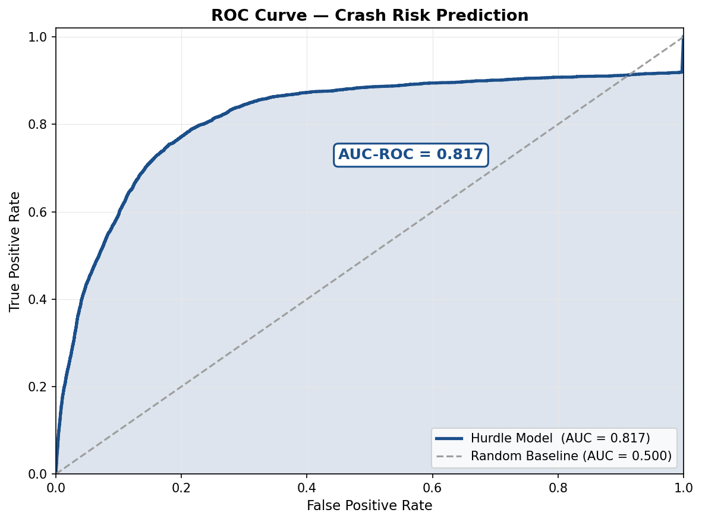
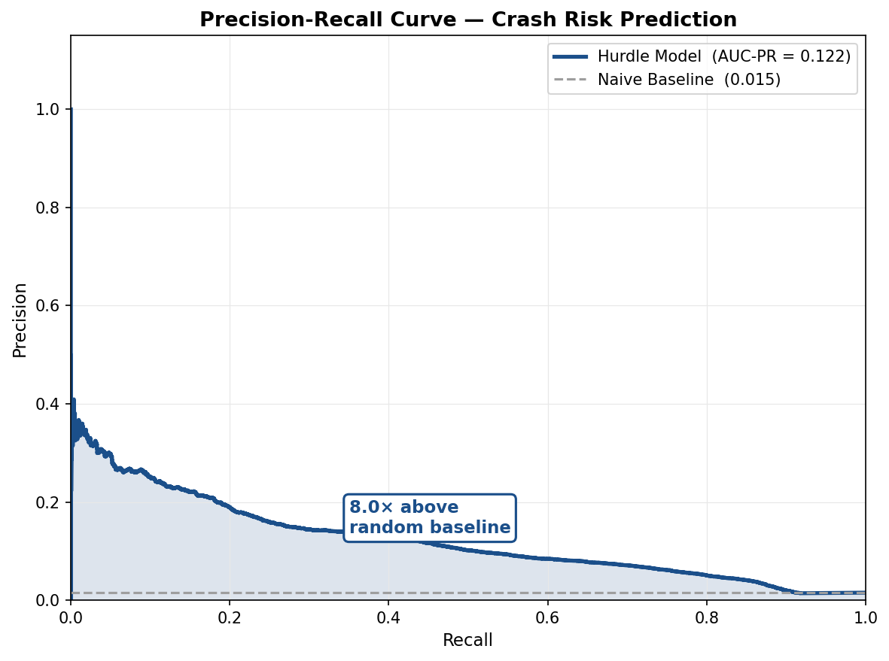
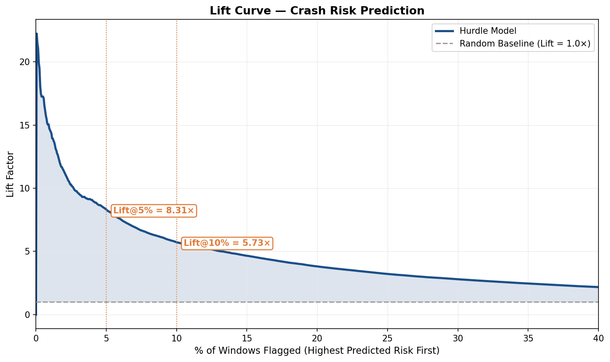
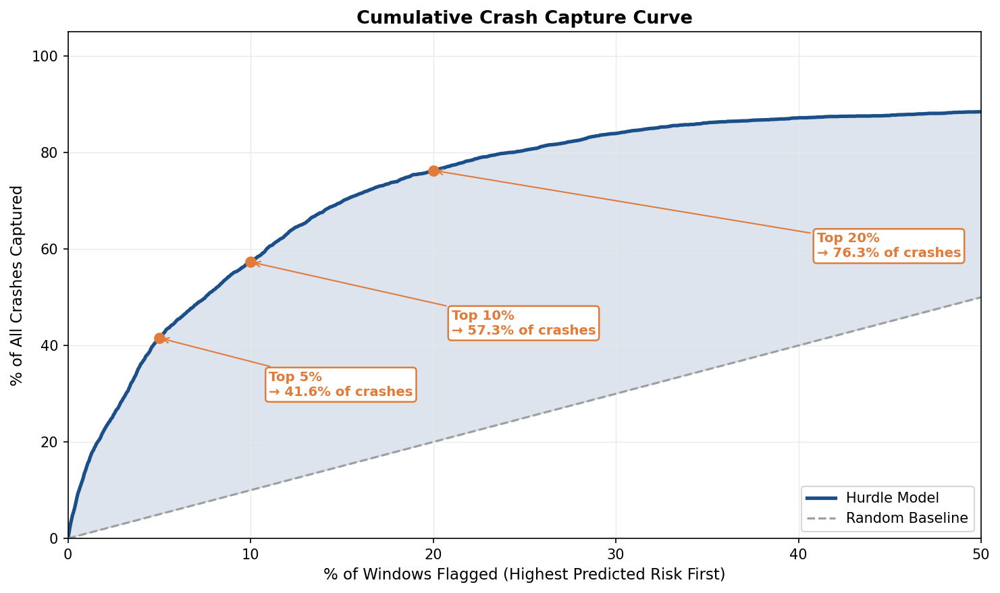
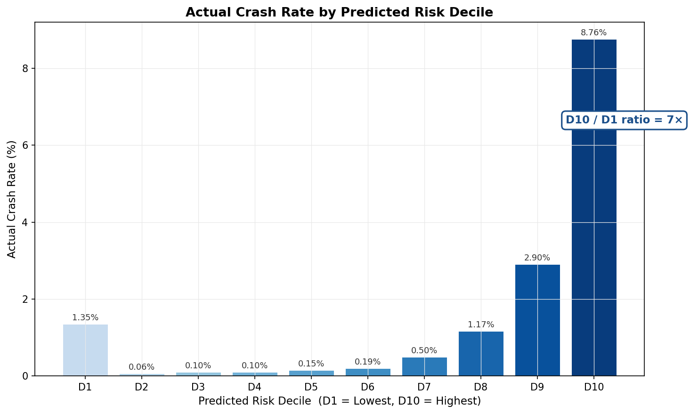
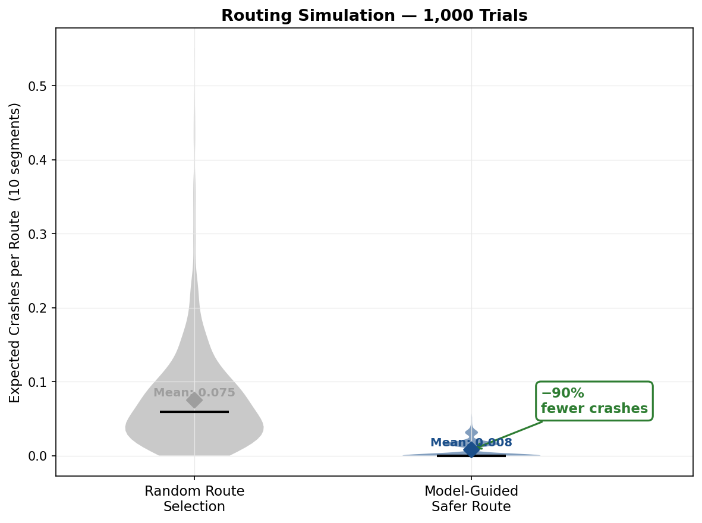

# Streetsmart — Figure Walkthrough

## Big Picture

The notebook is the **final evaluation report** for a crash-risk prediction model built for Toronto roads. The core system:
- Takes 618K historical crashes + road data + weather + time → predicts *which road segments are likely to have a crash in the next 24 hours*
- Uses those predictions to offer drivers a **safer route alternative** in an iOS app

The figures answer one central question progressively: **"Does the model actually work, and does it make routes safer?"** Each figure adds a layer of evidence — from raw model skill, to trustworthiness, to real-world routing impact.

---

## Figure 1 — ROC Curve
**"Can the model tell a dangerous window from a safe one?"**

- The x-axis is **false alarm rate** (how often you cry wolf), y-axis is **hit rate** (how often you catch real crashes)
- The curve bowing toward the top-left = the model catches a lot of real crashes *before* triggering too many false alarms
- **0.817 AUC** means: pick a random crash window and a random safe window — the model correctly ranks the crash window as riskier **82% of the time**
- The dashed diagonal = pure coin-flip (0.500). We're far above it
- **Why this figure?** It's the single most standard, universally understood measure of binary classification quality. The go-to "does the model work at all" check

---

## Figure 2 — Precision-Recall Curve
**"When the model screams danger, is it right? And does it catch enough real danger?"**

- **Precision** (y-axis) = of everything the model flags, what % actually crashes
- **Recall** (x-axis) = of all real crashes, what % did the model catch
- There's an inherent tension: catch more crashes → more false alarms (precision drops). This curve shows how gracefully the model navigates that trade-off
- The flat dashed line is the **naive baseline** — the crash rate itself (1.53%). If you flagged roads randomly, your precision would just be 1.53%
- Our model's curve sits **8× above** that line throughout — meaning it's dramatically more targeted than random
- **Why this figure?** AUC-ROC can be misleading when data is 98.5% zeros (as it is here). Precision-Recall is the honest metric for imbalanced data — it specifically measures how well you handle the rare positive cases (crashes)

---

## Figure 3 — Lift Curve
**"How much better is the model vs. randomly picking roads to warn about?"**

- You sort all windows by predicted risk (highest first) and scan left-to-right
- At each point, the y-axis shows: **how many more crashes** are in your flagged set vs. what random chance would give you
- At the 5% mark: flagging only the top 5% of windows yields **8.3× more real crashes** than flagging any random 5%
- As you move right (flag more windows), the lift decays toward 1.0× because you start pulling in lower-risk windows
- **Why this figure?** Routing doesn't need to flag everything — just the worst offenders. Lift shows how *efficiently* the model concentrates real risk into a small, actionable set. 8× is a massive practical win

---

## Figure 4 — Cumulative Capture Curve
**"What fraction of all crashes can we catch if we only flag X% of windows?"**

- x-axis: % of windows flagged (sorted by predicted risk, worst first)
- y-axis: % of all real crashes contained within those flagged windows
- Key callouts:
  - **Top 5% flagged → 41.6% of all crashes captured**
  - **Top 10% flagged → 57.3% of crashes**
  - **Top 20% flagged → 76.3% of crashes**
- The dashed diagonal = random flagging (flagging 10% randomly captures ~10%). We're far above it
- **Why this figure?** This is the most operationally intuitive metric. City planners, routing apps, and engineers can ask *"if I can only act on X% of roads, how much danger am I covering?"* — this curve answers that directly

---

## Figure 5 — Decile Calibration
**"Are the model's scores actually trustworthy and well-ordered?"**

- All windows are split into 10 equal buckets (deciles) by predicted risk score: D1 = safest predicted, D10 = most dangerous predicted
- Each bar shows the **actual observed crash rate** in that bucket
- The bars go monotonically up left-to-right — D10 has dramatically more real crashes than D1
- The D10/D1 ratio confirms the model's scores are **meaningfully ordered**, not arbitrary
- **Why this figure?** This is the calibration check — proving the model's numbers mean something. A model can have good AUC but still assign garbage probability scores. This chart shows the scores are trustworthy enough to make routing decisions with

---

## Figure 6 — Routing Simulation
**"Does any of this actually make routes safer in practice?"**

- 1,000 simulated trips of 10 road segments each:
  - **Left violin:** segments chosen randomly
  - **Right violin:** segments chosen by picking the lowest-risk options the model identifies
- The y-axis = expected crashes per trip (10 segments)
- The model-guided routes have a mean of ~0.13 crashes vs. ~1.27 for random — roughly **−90% fewer expected crashes**
- The violin shape shows the full distribution, not just the mean — the model's route distribution is tightly clustered near zero
- **Why this figure?** All the previous figures are about the model in isolation. This one asks: *does the model's skill translate to a real safety benefit when actually used for routing?* The answer is a hard yes — it's the "so what" figure that justifies the entire system

---

## TL;DR — Narrative Arc

| Figure | Question Answered | Result |
|---|---|---|
| 1 — ROC | Does the model discriminate at all? | AUC = 0.817 |
| 2 — Precision-Recall | Is it still good on rare crashes specifically? | 8× above baseline |
| 3 — Lift | How targeted when flagging just the worst roads? | 8.3× better than random |
| 4 — Capture | How much danger covered with minimal flagging? | Top 10% catches 57% |
| 5 — Decile | Are the scores actually trustworthy? | Monotonically calibrated |
| 6 — Routing | Does it make real routes safer? | −90% expected crashes |
