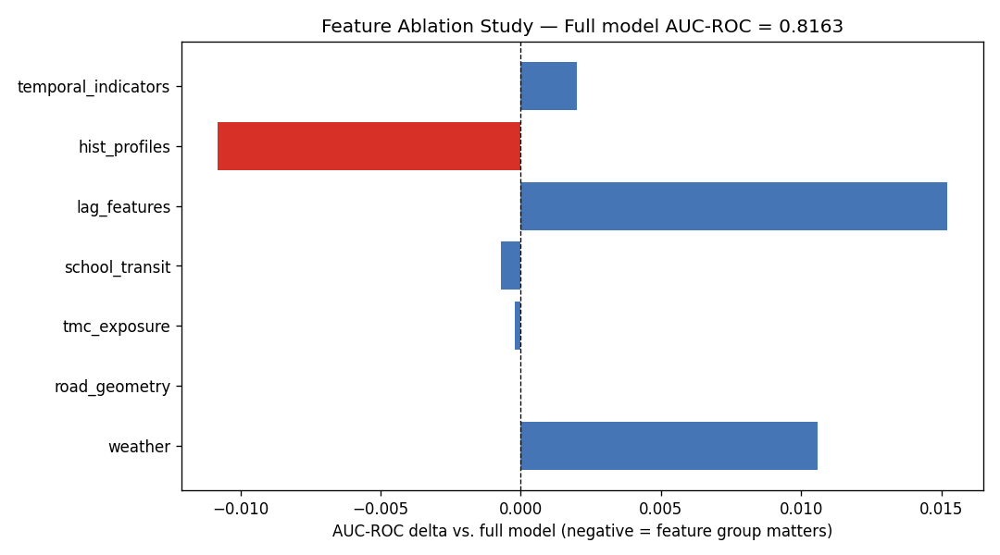

# Feature Ablation Study

**Full model AUC-ROC (baseline): 0.8163**

Each row shows performance when that feature group is removed entirely.
A large negative delta = that group contributes meaningful signal.

## Results

| Feature Group | AUC-ROC | Δ vs Full Model | Lift@5% | Time (s) |
|---|---|---|---|---|
| **hist_profiles** | 0.8056 | ▼ -0.0108 | 7.8 | 7.7 |
| **school_transit** | 0.8156 | ≈ -0.0007 | 8.48 | 7.9 |
| **tmc_exposure** | 0.8161 | ≈ -0.0002 | 8.39 | 8.8 |
| **road_geometry** | 0.8164 | ≈ +0.0000 | 8.42 | 6.9 |
| **temporal_indicators** | 0.8183 | ≈ +0.0020 | 8.71 | 8.4 |
| **weather** | 0.8269 | ▲ +0.0106 | 8.26 | 10.5 |
| **lag_features** | 0.8316 | ▲ +0.0152 | 8.9 | 7.8 |

## Key Finding
The **hist_profiles** feature group caused the largest performance drop
(AUC-ROC delta = -0.0108) when removed.

AUC-ROC range across ablation runs: 0.8056 – 0.8316

## Stability
The model retained AUC-ROC > 0.8056 even with any single feature group removed,
demonstrating that no single group is a single point of failure.

