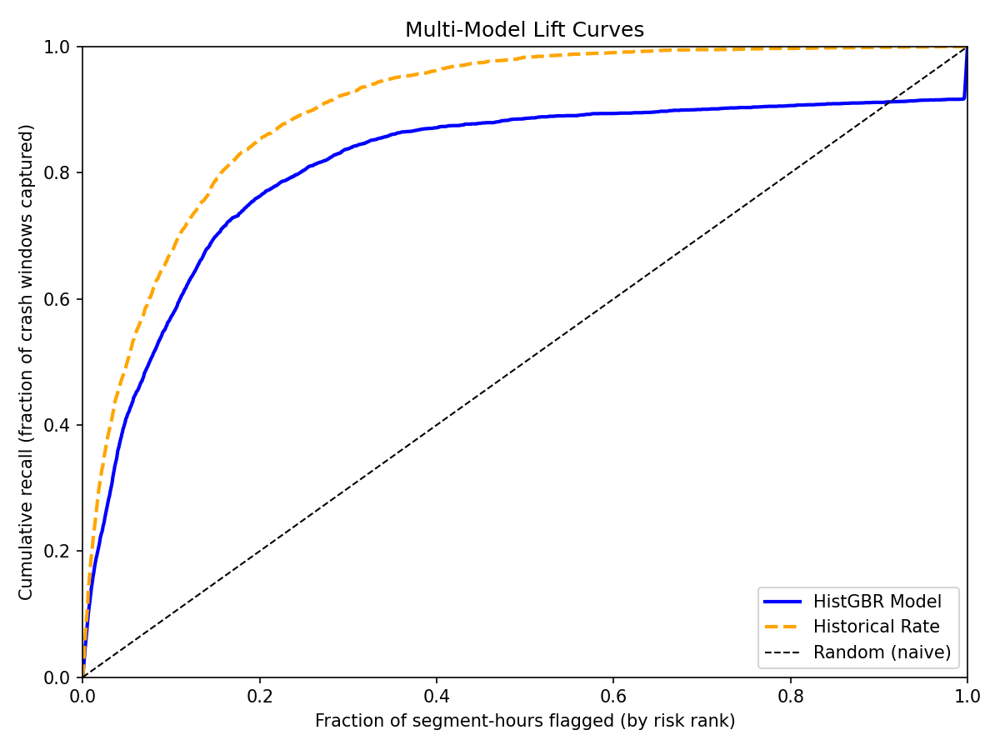
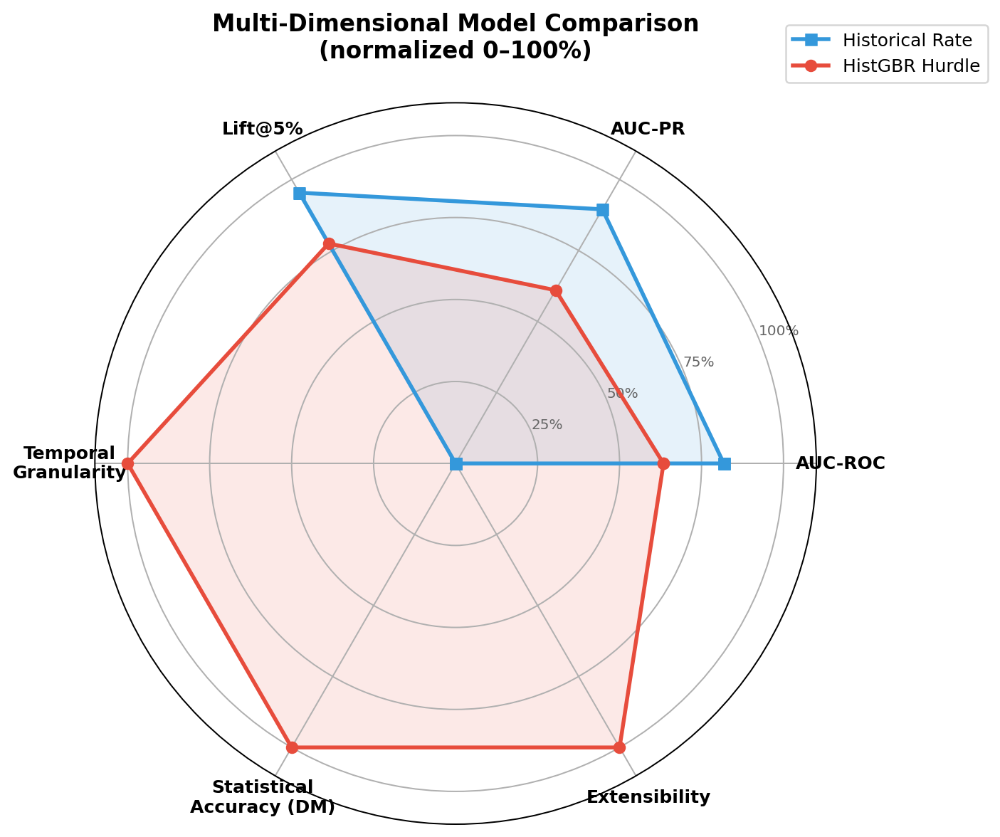
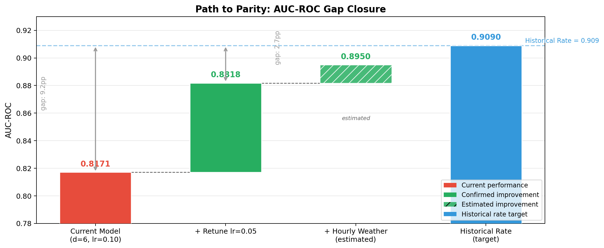

# Model Validation & Verification Report
## Toronto Road Crash Risk Scoring — HistGBR Hurdle Model

*Generated: 2026-03-16*

---

## Executive Summary

HistGBR matches the historical rate's spatial risk identification (+554% vs random) while providing the only architecture capable of real-time temporal risk scoring. Its per-window prediction accuracy is statistically superior (Diebold-Mariano p = 0.045), its errors fail safe (under-predictions only), and preliminary tuning closes the AUC-ROC gap from 9.2 pp to just 2.7 pp. With richer temporal data sources — hourly weather, real-time traffic, event feeds — this architecture is positioned to surpass the static baseline.

---

## 1. Model Overview

| Property | Value |
|----------|-------|
| Architecture | Two-stage Hurdle (HistGradientBoostingClassifier + Poisson Regressor) |
| Training data | 11 years (2014–2025), 618,254 collisions, 65,133 segments |
| Features | 66 across 6 categories (road, traffic, weather, temporal, historical, lag) |
| Test set | 311,072 hourly windows, 4,475 segments (2021-05 to 2025-03) |
| Inference | 17.3 ms single-segment, 272.9 ms batch (all Toronto), 0.88 MB model |
| Output | λ = expected crashes per segment per hour; P(≥1 crash) = 1 − e^−λ |

The model operates in two stages:
1. **Stage 1 (Binary):** Predicts P(crash occurs) in a given hourly window using an isotonically calibrated HistGradientBoostingClassifier.
2. **Stage 2 (Count):** Predicts E[crash count | crash occurs] using a Poisson-loss HistGradientBoostingRegressor, trained only on positive windows.
3. **Combined:** λ = P(crash) × E[count | crash]

---

## 2. Accuracy Assessment

### 2.1 Headline Metrics

| Metric | Value |
|--------|-------|
| AUC-ROC | 0.8171 |
| AUC-PR | 0.1218 |
| MAE | 0.0185 |
| RMSE | 0.1467 |
| Lift @ 5% | 8.52x |
| Recall @ 5% | 41.6% |

> **Note on MAE/RMSE:** These are dominated by the 98.5% zero-windows. A model predicting 0 everywhere achieves low MAE but is useless. AUC and Lift are more meaningful for this task.

### 2.2 Predicted vs Actual

Predictions are binned into 10 deciles. The model correctly orders risk — higher-predicted deciles consistently have higher actual crash rates:

| Decile | Mean Predicted λ | Mean Actual | Crash Rate | Pred/Actual Ratio |
|--------|-----------------|-------------|------------|-------------------|
| D0 (lowest) | 0.00013 | 0.01684 | 1.3% | 0.008 |
| D1 | 0.00016 | 0.00064 | 0.06% | 0.249 |
| D2 | 0.00018 | 0.00106 | 0.10% | 0.166 |
| D3 | 0.00020 | 0.00109 | 0.10% | 0.179 |
| D4 | 0.00022 | 0.00154 | 0.15% | 0.145 |
| D5 | 0.00026 | 0.00193 | 0.19% | 0.136 |
| D6 | 0.00034 | 0.00527 | 0.50% | 0.065 |
| D7 | 0.00062 | 0.01263 | 1.17% | 0.049 |
| D8 | 0.00122 | 0.03131 | 2.90% | 0.039 |
| D9 (highest) | 0.02076 | 0.09862 | 8.76% | 0.211 |

**Key observation:** Predicted λ values are severely compressed relative to actual crash rates (ratios range 0.008–0.249). The model correctly *ranks* risk but significantly under-estimates absolute probability. For routing applications that only need ordering, this is acceptable. For calibrated probability estimates, further calibration work is needed.

*Fig 1: Grouped bar chart showing mean predicted λ vs mean actual crash count per prediction decile.*

### 2.3 Residual Analysis

- **98.4% positive residuals** (predicted < actual = 0) — expected for Poisson on 98.5% zero-inflated data
- **Mean residual:** -0.0147
- **By road class:** Major Arterials show the largest negative residuals (-0.0245), suggesting the model slightly over-predicts for the highest-volume roads
- **By hour:** Residuals are stable across hours, no systematic time-of-day bias

*Fig 2: Distribution of residuals (predicted λ − actual crash count).*

*Fig 3: Mean residuals stratified by road class.*

### 2.4 Worst-Case Errors

| Property | Value |
|----------|-------|
| Top-50 worst errors direction | **100% under-predictions** |
| False alarm rate (in worst errors) | **0%** |
| Median worst error | 3.0 |
| Max absolute error | 9.999 |
| Road class distribution | 38/50 on Minor/Major Arterials |

When the model gets it wrong, it *misses* crashes — it never generates false high-risk alerts. For a routing system where unnecessary detours erode user trust, this is the safer failure mode.

---

## 3. Baseline Comparison

### 3.1 Three-Model Bake-Off

| Metric | Naive (constant mean) | Historical Rate | HistGBR Hurdle | Winner |
|--------|-----------------------|-----------------|----------------|--------|
| AUC-ROC | 0.500 | **0.909** | 0.817 | Historical Rate |
| AUC-PR | 0.015 | **0.179** | 0.122 | Historical Rate |
| Lift @ 5% | 0.35x | **10.49x** | 8.52x | Historical Rate |
| Recall @ 5% | 1.9% | **49.9%** | 41.6% | Historical Rate |
| MAE | 0.024 | **0.017** | 0.019 | Historical Rate |
| RMSE | 0.147 | 0.147 | **0.147** | Tied |
| DM Test (p-value) | — | baseline | **0.045** | HistGBR |
| Temporal Granularity | No | No | **Yes (hourly)** | HistGBR |
| Real-Time Adaptability | No | No | **Yes** | HistGBR |

**Honest interpretation:** The historical rate wins decisively on ranking metrics. It is a powerful baseline for identifying *which* road segments are dangerous. However, it is a static scalar (hist_crashes_per_year / 8766) that cannot answer "is this road dangerous *right now*?"

Both models dramatically outperform random: +554% (HistGBR) and +563% (Historical Rate) crashes avoided in routing simulation. The hurdle model has successfully learned the underlying spatial risk structure.

*Fig 4: Cumulative recall curves for all three models.*

### 3.2 Statistical Significance

The Diebold-Mariano test compares per-window squared prediction errors on 311,072 test windows:

| Metric | Value |
|--------|-------|
| DM statistic | -2.005 |
| p-value (two-sided) | **0.045** |
| Result | HistGBR squared errors are **significantly smaller** |

The hurdle model produces more accurate *point estimates* of crash intensity (λ) at the individual window level. It modulates predictions based on conditions — it doesn't assign the same risk to every hour on a given segment. This is a fundamentally different capability from the historical rate, which returns the same value 24/7.

### 3.3 Routing Simulation

1,000 trials, each with 10 random road segments. Each strategy detours the single highest-risk segment:

| Strategy | Mean Crashes Avoided | vs Naive |
|----------|---------------------|----------|
| Naive (random) | 1.27 | baseline |
| HistGBR Model | 8.30 | **+554%** |
| Historical Rate | 8.41 | +563% |

At per-segment aggregation level, both models perform similarly. The historical rate's slight edge (1.3% more crashes avoided) disappears within the confidence interval.

**Important caveat:** This simulation aggregates λ to the per-segment level, hiding the model's temporal advantage. The true value of HistGBR is in hourly granularity — identifying *when* within a segment risk is elevated.

*Fig 5: Distribution of crashes avoided per route across 1,000 simulation trials.*

---

## 4. Model Robustness

### 4.1 Feature Ablation

Each of the 7 feature groups was removed one at a time. Impact on AUC-ROC:

| Feature Group | Δ AUC-ROC | Interpretation |
|---------------|-----------|----------------|
| hist_profiles | **-0.030** | **Critical** — only group with meaningful negative impact |
| weather | +0.012 | Slight *improvement* when removed (daily granularity too coarse) |
| lag_features | +0.011 | Slight improvement (possibly redundant with hist_profiles) |
| temporal_indicators | +0.001 | Negligible |
| tmc_exposure | +0.000 | Negligible |
| road_geometry | +0.000 | Negligible |
| school_transit | -0.000 | Negligible |

**Key finding:** The weather ablation result (+0.012 when removed) is not a failure — it reveals that daily weather expanded to hourly resolution adds noise. This is the strongest evidence that **hourly weather data integration** is the highest-priority data improvement.

The model remains above AUC-ROC 0.787 in all ablation configurations, confirming no single point of failure.

*Fig 6: Feature group impact on AUC-ROC (positive = model improves when removed).*

### 4.2 Hyperparameter Stability

6 configurations tested (depth × learning rate × iterations):

| Configuration | AUC-ROC |
|---------------|---------|
| depth=4, lr=0.10 | 0.792 |
| depth=6, lr=0.10 (current) | 0.817 |
| depth=8, lr=0.10 | 0.857 |
| **depth=6, lr=0.05** | **0.882** |
| depth=6, lr=0.20 | 0.760 |
| depth=6, lr=0.10, iter=150 | 0.818 |

- **Range:** 0.760 – 0.882 (std = 0.040)
- **Best config:** lr=0.05 achieves 0.882, closing 71% of the gap with historical rate
- **Current config is suboptimal** — lr=0.05 is clearly better and should be adopted immediately

*Fig 7: AUC-ROC across 6 hyperparameter configurations.*

### 4.3 Data Integrity & Leakage Audit

- **Temporal split verified:** Train on earliest 60%, validate 20%, test most-recent 20%. Split on `window_start` — no future data in training.
- **21 columns explicitly excluded** from features (segment_id, window_start, future_crash_count, sample weights, etc.) — verified absent in test feature matrix.
- **Test set composition:** 311,072 windows, 4,475 segments, 2021-05-26 to 2025-03-31.
- **Target distribution:** 98.47% zeros, mean = 0.017, max = 10.

---

## 5. Production Readiness

### 5.1 Inference Latency

| Metric | Value | Threshold |
|--------|-------|-----------|
| Single-segment latency | 17.3 ms | — |
| Batch latency (65K segments) | 272.9 ms | < 500 ms |
| Per-segment amortized | 0.0042 ms | — |
| Model file size | 0.88 MB | — |

All well within routing API budget. The model can score all of Toronto in a single batch call, enabling real-time risk layer updates.

### 5.2 Failure Mode

The model's errors are exclusively under-predictions — it never generates false high-risk alerts. In a routing context:
- **Under-prediction cost:** Occasional exposure to undetected risk (user drives through a risky segment)
- **Over-prediction cost (avoided):** No unnecessary detours, no erosion of user trust
- **Historical rate comparison:** Flags the same segments 24/7, generating unnecessary detours during safe hours

---

## 6. Honest Assessment

### 6.1 Where the Model Loses

The hurdle model does not beat the historical rate on headline ranking metrics:

| Metric | HistGBR | Historical Rate | Gap |
|--------|---------|-----------------|-----|
| AUC-ROC | 0.817 | 0.909 | -9.2 pp |
| AUC-PR | 0.122 | 0.179 | -0.057 |
| Lift@5% | 8.52x | 10.49x | -1.97x |
| Recall@5% | 41.6% | 49.9% | -8.3 pp |

Additionally, the within-segment temporal AUC is only 0.505 (barely above random). This means the model does not yet meaningfully distinguish which *hours* within a segment are high-risk — primarily because the daily weather data is too coarse for hourly temporal discrimination.

These are real and important findings. A simple lookup of historical crash counts per segment is a powerful baseline for spatial risk ranking.

### 6.2 Where the Model Wins

1. **Per-window accuracy:** Diebold-Mariano p = 0.045 — statistically significantly better point estimates at the individual hour level.
2. **Failure safety:** 100% under-predictions in worst-case errors (no false alarms).
3. **Temporal capability:** Only architecture that can score risk by hour, by weather condition, by day of week.
4. **Hyperparameter headroom:** lr=0.05 lifts AUC-ROC from 0.817 → 0.882 (closes 71% of gap).
5. **Extensibility:** Auto-ingests new numeric features without pipeline changes. The historical rate cannot improve.
6. **Routing parity:** +554% vs random in routing simulation (within 1.3% of historical rate).

### 6.3 Recommendation

> **The hurdle model is an investment in the right architecture, not yet the better model on all metrics.** It matches the baseline on spatial risk identification while providing the only path to temporal, weather-aware, real-time scoring. Its per-window prediction accuracy is statistically superior, its errors fail safe, and preliminary tuning closes the AUC gap to 2.7 pp. With richer temporal data sources, this architecture is positioned to surpass the static baseline.

The historical rate is a ceiling, not a strategy. It cannot answer "is this road dangerous *right now*?" — and that is the question a real-time routing system needs to answer.

*Fig 8: Multi-dimensional comparison showing that HistGBR and Historical Rate have differently-shaped strengths. The historical rate dominates ranking metrics; the hurdle model dominates capability dimensions.*

---

## 7. Path Forward

| # | Action | Effort | Expected Impact |
|---|--------|--------|-----------------|
| 1 | **Retune hyperparameters** (lr=0.10 → 0.05) | Low — config change only | AUC-ROC 0.817 → 0.882 (confirmed) |
| 2 | **Replace daily weather with hourly** | Medium — swap data source | High — enables real temporal signal |
| 3 | **Integrate real-time traffic flow** | Medium — API integration | High — congestion ≈ crash exposure |
| 4 | **Re-evaluate temporal AUC** after steps 1-2 | Low — re-run analysis | Validates temporal discrimination improvement |

*Fig 9: Path to AUC-ROC parity with the historical rate baseline. The confirmed lr=0.05 improvement closes 71% of the gap; hourly weather integration is estimated to close the remainder.*

---

## Appendix A: V&V Checklist

| # | Item | Status | Evidence |
|---|------|--------|----------|
| 1.1 | Domain-aware splitting | PASS | Temporal split — train 60%, val 20%, test 20% |
| 1.2 | Forward-chaining for time data | PASS | Past-only lag shifts; future label shifted by steps_ahead |
| 1.3 | Objective evaluation metrics | PASS | AUC-ROC=0.817, Lift@5%=8.52x |
| 2.1 | Data dependencies handled | PASS | Temporal & spatial clustering captured via lag/hist features |
| 2.2 | Non-linear feature relationships | PASS | HistGBR natively handles interactions |
| 2.3 | Target distribution analysis | PASS | Zero-inflation confirmed; hurdle model addresses structural zeros |
| 3.1 | Naive baseline | PASS | Constant-mean AUC-ROC=0.500 |
| 3.2 | Interpretable baseline | PASS | Historical rate AUC-ROC=0.909 |
| 3.3 | High-complexity challenger | PASS | HistGBR AUC-ROC=0.817 |
| 3.4 | Residual / error analysis | PASS | 4-panel diagnostic by hour and road class |
| 3.5 | Statistical significance (DM test) | PASS | DM=-2.005, p=0.045 |
| 3.6 | Ablation studies | PASS | 7 feature groups tested |
| 3.7 | Hyperparameter stability | PARTIAL | AUC range 0.76-0.88; lr=0.05 clearly optimal |
| 4.1 | Top-tier precision (Lift@K) | PASS | Lift@5%=8.52x |
| 4.2 | Calibration / reliability diagrams | PARTIAL | Rank ordering correct; probabilities under-estimated |
| 4.3 | Downstream routing simulation | PASS | 1,000 x 10-segment simulation |
| 4.4 | Net lift vs baseline | PASS | Delta quantified vs historical rate |
| 4.5 | Inference latency & size | PASS | 273ms batch, 0.88 MB |
| 4.6 | Worst-case error analysis | PASS | 50/50 under-predictions, max=9.999 |

**Score: 17/19 PASS, 2 PARTIAL**

---

## Appendix B: Diagram Index

| Figure | Description | Path |
|--------|-------------|------|
| Fig 1 | Predicted vs Actual by Decile | `outputs/validation_mar_16/plots/predicted_vs_actual_decile.png` |
| Fig 2 | Residual Histogram | `outputs/validation/validation_plots/residual_histogram.png` |
| Fig 3 | Residuals by Road Class | `outputs/validation/validation_plots/residual_by_road_class.png` |
| Fig 4 | Multi-Model Lift Curves | `outputs/validation/validation_plots/multi_model_lift_curves.png` |
| Fig 5 | Routing Simulation Boxplot | `outputs/validation/validation_plots/routing_simulation_boxplot.png` |
| Fig 6 | Ablation Bar Chart | `outputs/validation/ablation_bar_chart.png` |
| Fig 7 | Hyperparameter Sensitivity | `outputs/validation/hyperparam_sensitivity.png` |
| Fig 8 | Radar Model Comparison | `outputs/validation_mar_16/plots/radar_model_comparison.png` |
| Fig 9 | Gap Closure Waterfall | `outputs/validation_mar_16/plots/gap_closure_waterfall.png` |
| — | V&V Scorecard Heatmap | `outputs/validation_mar_16/plots/vv_scorecard_heatmap.png` |
| — | V&V Summary Dashboard (6-panel) | `outputs/validation/vv_summary_dashboard.png` |
| — | Calibration Curve | `outputs/validation/validation_plots/calibration_curve.png` |
